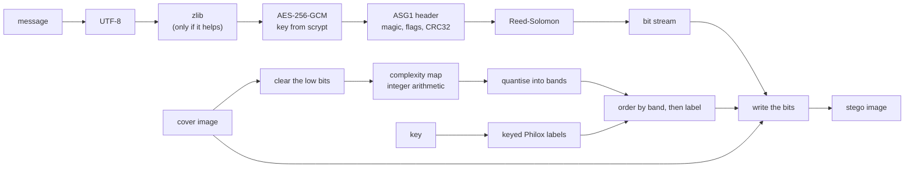
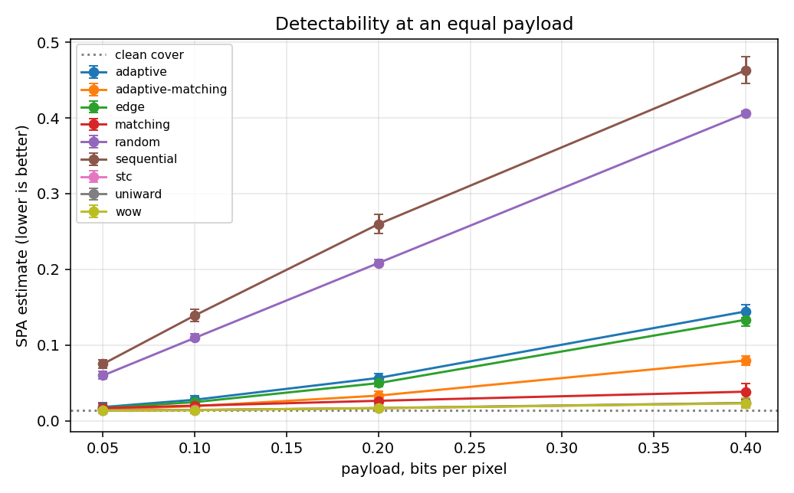
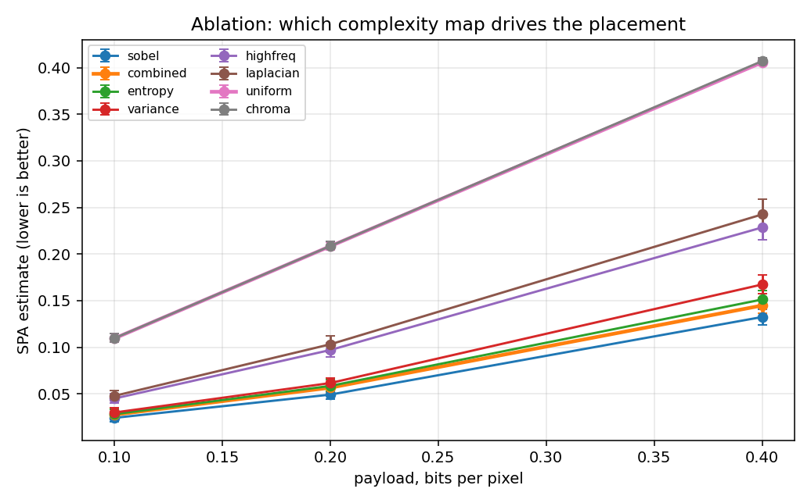

# AdaptiveStego

[](https://github.com/RE22GDV/AdaptiveStego/actions/workflows/ci.yml)
[](https://www.python.org/)
[](LICENSE)
[](#installation)

A research bench for image steganography and steganalysis: content-adaptive LSB
embedding, minimum-distortion embedding through syndrome-trellis coding, five
baseline methods to compare them against, quality metrics, twelve attacks on
the container, a four-stage detection toolkit with a trained classifier, and a
desktop interface in English, Ukrainian and Russian.

**The hypothesis this project exists to test.** Choosing which samples and which
colour channels carry the message according to the local textural complexity of
the image lowers the detectability of the message at a comparable capacity and
visual quality.


The same 2.5 KB message, hidden four ways. Sequential LSB fills the image from
the top regardless of content. Random LSB spreads over everything, flat areas
included. The adaptive methods trace the edges and settle in the texture, and
they leave the flat rectangle untouched - the receiver still finds them, because
the map that ranks the pixels is computed from bits that embedding never
changes.

---

## Table of contents

- [Installation](#installation)
- [Usage](#usage) - [desktop](#desktop-interface), [command line](#command-line), [Python](#python-api)
- [How it works](#how-it-works)
- [Methods](#embedding-methods)
- [Finding hidden data](#finding-hidden-data)
- [Passwords](#passwords)
- [Syndrome coding](docs/syndrome-coding.md)
- [Experimental results](#experimental-results)
- [Performance](#performance)
- [Reproducibility](#reproducibility)
- [What it does not do](#what-it-does-not-do)
- [Project layout](#project-layout)
- [Development](#development)

---

## Installation

Python 3.10 or newer, on Windows, macOS or Linux.

```bash
git clone https://github.com/RE22GDV/AdaptiveStego.git
cd AdaptiveStego
pip install -r requirements.txt
```

Or install the package itself, which also puts `adaptivestego` and `adaptivestego-gui` on
your PATH:

```bash
pip install -e ".[all]"
```

The library needs only **numpy** and **opencv-python**. Everything else is
optional: `cryptography` for password protection, `reedsolo` for error
correction, `pandas`/`matplotlib`/`scipy` for the experiment scripts. Missing
optional packages are reported with the exact command to install them, never as
an import traceback.

The desktop interface uses tkinter, which ships with CPython on Windows and
macOS. Some Linux distributions package it separately:

```bash
sudo apt install python3-tk        # Debian, Ubuntu
sudo dnf install python3-tkinter   # Fedora
sudo pacman -S tk                  # Arch
```

Verify the installation, including that it produces bit-identical results to the
reference build:

```bash
python -m adaptivestego selftest
```

## Usage

### Desktop interface

```bash
python -m adaptivestego gui
```


Five tabs: **Embed** (with a live capacity readout and a map of the pixels that
changed), **Extract**, **Analyse** (chi-square, SPA, bit-plane statistics, and
capacity per method), **Benchmark** (compare every method on your own images and
export the table as CSV) and **About** (the determinism self-test).

The interface language is chosen in the top right corner - English, Ukrainian or
Russian - and the choice is remembered between sessions. Long operations run in
a worker thread, so the window stays responsive on large images.


The same panel in each of the three languages:


### Command line

```bash
# hide a message, encrypted, with error correction
python -m adaptivestego embed -c cover.png -o stego.png -t "meet at 17:40" \
    --method adaptive --key my-key --password --ecc 16

# recover it
python -m adaptivestego extract -i stego.png --method adaptive --key my-key --password

# how much would fit
python -m adaptivestego capacity -i cover.png --method adaptive

# is there anything in this image?  (file structure, statistics, model, scan)
python -m adaptivestego detect -i suspect.png

# just the pixel statistics, or just the container search
python -m adaptivestego analyze -i suspect.png
python -m adaptivestego scan    -i suspect.png --key my-key

# quality of a cover/stego pair, and attacks on a container
python -m adaptivestego metrics -c cover.png -s stego.png
python -m adaptivestego attack -i stego.png -o attacked.png --attack jpeg:quality=90
```

Passwords are never taken from the command line by default: `--password` without
a value prompts for it, and `--password-env VAR` reads it from the environment,
so it does not end up in the process list or the shell history.

Extraction happens in two phases. It finds the container and says what it is
before it needs a password, and asks for one only once it knows one is
required:

```console
$ python -m adaptivestego extract -i stego.png --method adaptive --key my-key
found: 77 B container, 37 B message, encrypted
Password:
meet at 17:40
```

### Python API

```python
import adaptivestego as sl

cover = sl.read_image("cover.png")
result = sl.embed(cover, "secret", method="adaptive", key="my-key",
                  password="pw", ecc_nsym=16)
sl.write_image("stego.png", result.stego)

print(result.summary())
# {'method': 'adaptive', 'payload_bytes': 91, 'bpp': 0.0071, ...}

message = sl.extract(sl.read_image("stego.png"), method="adaptive",
                     key="my-key", password="pw")
```

For experiments there is a raw mode that writes exactly the bits you give it,
with no container header, so a payload of 0.4 bpp means exactly that:

```python
bits = sl.payload_bits_for_bpp(cover, 0.4)          # 0.4 * pixels, rounded
payload = adaptivestego.prng.deterministic_bits("seed-material", "payload", bits)
result = sl.embed_raw(cover, payload, method="adaptive", key="k")
back = sl.extract_raw(result.stego, bits, method="adaptive", key="k")
```

Detection is available on its own, and never needs a password:

```python
probe = sl.detect(sl.read_image("suspect.png"), method="adaptive", key="my-key")
print(probe.summary())
# {'found': True, 'container_bytes': 77, 'message_bytes': 37,
#  'encrypted': True, 'needs_password': True, 'readable': False, ...}

from adaptivestego import forensics
report = forensics.full_report("suspect.png")     # all four stages
```

The method, the key and the map settings are **not stored in the image**. The
receiver has to know them; only what is needed to validate the data is embedded
(see [the container format](docs/format.md)).

## How it works



Two design decisions carry most of the weight.

**The map is computed from the image with its lowest bits cleared** - exactly
the bits that embedding is allowed to change. Sender and receiver therefore
derive the same ranking of pixels from different images, and no synchronisation
data has to be transmitted. For +/-1 embedding the direction of the change is
constrained so that a carry can never reach the bits the map depends on.

**Everything on that path is integer arithmetic.** A one-ULP difference in a
floating point map on another machine would move a pixel into a neighbouring
band, shift the whole ordering and destroy the message. Convolutions run in
CV_16S, window sums through an integral image in int64, normalisation through
exact order statistics, and the entropy table is computed with `decimal` rather
than the platform's libm.

Full diagrams, including extraction and the lazy ordering, are in
[docs/architecture.md](docs/architecture.md).

## Embedding methods

| Method | Order of positions | Bit written | Role |
|---|---|---|---|
| `sequential` | consecutive, from the top-left | LSB replacement | baseline, trivially detected |
| `random` | keyed permutation | LSB replacement | keyed baseline |
| `matching` | keyed permutation | +/-1 | outside the reach of chi-square and SPA |
| `edge` | Sobel gradient | LSB replacement | classic edge-adaptive LSB |
| `adaptive` | combined complexity map | LSB replacement | the proposed method |
| `adaptive-matching` | combined complexity map | +/-1 | the proposed method with +/-1 |
| `stc` | none - raster order | +/-1 | syndrome coding with this project's cost model |
| `wow` | none - raster order | +/-1 | syndrome coding with the WOW cost model |
| `uniward` | none - raster order | +/-1 | syndrome coding with the S-UNIWARD cost model |

The combined map sums the normalised Sobel gradient, local variance, local
entropy, a high-pass response and the spread between colour channels, then
weights the channels by how visible a change is in each.

The last three are different in kind from the other six. It does not rank anything: the
message is the syndrome of the whole stego bit vector under a keyed parity
check matrix, and the encoder searches the trellis for the cheapest vector that
satisfies it. The decoder therefore needs no cost map at all - which also means
the map may be built from the untouched cover at full precision. See
[docs/syndrome-coding.md](docs/syndrome-coding.md).

They share one coder and differ only in the cost model, which is what makes
them comparable. `wow` and `uniward` are ports of the reference implementations
published by the Binghamton DDE Lab, and they are checked against that MATLAB
code rather than assumed correct: on four test images the costs agree to
**4e-11 or better** once clamped at a cost no embedder would ever act on, and
the maps of unusable samples match exactly. The comparison is pinned by committed
reference vectors, so it re-runs on every commit without MATLAB
(see [matlab/README.md](matlab/README.md)).

It was worth doing. The first comparison failed by a factor of five: MATLAB's
`conv2(..., 'same')` starts one sample later than the same call in OpenCV or
SciPy, and with two convolutions per filter that shifted every cost map by two
pixels. The two files also disagree on the wet cost - 10^10 in `WOW.m`, 10^8 in
`S_UNIWARD.m` - which no description of either algorithm mentions.

## Finding hidden data

`detect` runs four stages that look in different places. A clean result from
one says nothing about the others, so all four run and each reports its own
level; full details in [docs/detection.md](docs/detection.md).

**1. File structure.** Most of what is called image steganography in practice
never touches a pixel. Bytes appended after a PNG's IEND chunk, a message in a
`tEXt` chunk, a JPEG comment segment, the gap a BMP header may leave before its
pixels, an archive signature somewhere in the middle, an extension that does not
match the magic bytes - all definite answers, all cheap, all checked first.

**2. Pixel statistics.** Chi-square, SPA, RS and the weighted stego-image
estimator. The last three estimate the same quantity - the fraction of samples
changed by LSB replacement - and all three are reported, because they fail
differently.

**3. A trained detector.** SPAM features and Fisher's linear discriminant, 18 KB,
about 15 ms per image, trained on the first 5 000 BOSSBase images. This is the
only stage that sees LSB matching.

**4. A container scan.** If the data was hidden with this tool, the ASG1 header
can simply be found - every method and bit depth is tried. The key cannot be
searched, which is what it is for.

### What the detectors actually achieve

Measured on 150 BOSSBase images no shipped model was trained on
(`experiments/calibrate_detectors.py --skip 5000`). The numbers are the share of
images called out, so the first row is the false-positive rate:

| | SPA | RS | WS | verdict | model |
| --- | --- | --- | --- | --- | --- |
| **clean images** | 0.01 | 0.01 | 0.00 | **0.01** | 0.09 |
| sequential 0.1 | 0.66 | 0.74 | 0.75 | 0.73 | 0.28 |
| random 0.1 | 0.97 | 0.97 | 1.00 | 0.99 | 0.65 |
| random 0.5 | 1.00 | 1.00 | 1.00 | 1.00 | 0.98 |
| **matching 0.1** | 0.02 | 0.02 | 0.03 | 0.02 | **0.63** |
| **matching 0.5** | 0.07 | 0.07 | 0.07 | 0.07 | **0.91** |
| adaptive 0.25 | 0.47 | 0.59 | 0.18 | 0.47 | 0.53 |
| adaptive 0.5 | 1.00 | 1.00 | 0.82 | 1.00 | 0.83 |
| adaptive-matching 0.1 | 0.01 | 0.01 | 0.01 | 0.01 | 0.26 |
| adaptive-matching 0.5 | 0.87 | 0.96 | 0.66 | 0.87 | 0.92 |

Read the matching rows against the first one: the classical detectors fire on
LSB matching at exactly their false-positive rate, which is to say they do not
see it at all. That is not a shortcoming to be tuned away - they detect a
structure that ±1 embedding never creates - and it is the entire reason the
trained model is here.

Read the adaptive rows too. At 0.1 bpp nothing in this repository detects
content-adaptive embedding; the model is at 0.26, close to chance. Training
SRNet is the next step on the roadmap, and claiming detection here would be the
easiest way to publish something false.

Two detectors were deliberately left out of the verdict score after measuring
them: a high chi-square probability somewhere in the image occurs on 22 % of
clean photographs, and a calibrated HCF ratio below 0.92 on 29 %. Both are
reported; neither is evidence on its own. Only the *sequential shape* of
chi-square - high at the start of the image, low at the end - is specific
enough to count, at 1.3 % on clean images.

### Training your own detector

```bash
python experiments/train_detector.py --images "data/bossbase/*.pgm" \
    --limit 5000 --method matching adaptive-matching random adaptive \
    --bpp 0.1 0.2 0.4 --jobs 16
```

The split is by image, so a cover and the stego made from it never land on
opposite sides of it. Every model file carries its provenance - dataset,
method, payload, held-out AUC, and a digest of the image list it saw - and
every prediction reports it, because a model trained on 512x512 grayscale
photographs says nothing useful about a screenshot.

## Passwords

The password never enters the image in any mode: it derives a key, and the key
is used inside AES-256-GCM. What does travel with an encrypted message by
default is its *key material* - the scrypt salt, the GCM nonce and the flag
saying the payload is encrypted. Those are public by design, but they announce
that a password was used.

`--no-key-material` removes all three. The salt and the nonce are derived from
the password and the header fields instead, the container becomes byte for byte
the shape of an unencrypted one, and it is 28 bytes shorter. The receiver still
needs only the password.

```bash
python -m adaptivestego embed -c cover.png -o stego.png -t "secret" \
    --password --no-key-material
```

It costs three things, spelled out in [docs/security.md](docs/security.md):
the encryption becomes deterministic, the salt is no longer per-message random,
and nonce uniqueness rests on two messages never sharing both their lengths and
their CRC32 - which cannot happen by accident but can be arranged by someone who
chooses the plaintexts. **Do not use it for messages an adversary can
influence.** Use the default unless you specifically need the container to say
nothing.

## Experimental results

Everything below is reproduced by the scripts in `experiments/`. The design
matters as much as the numbers, so it is stated first.

**Research mode.** Payloads are raw: exactly `bpp x pixels` pseudo-random bits,
with no container header. The application container carries a fixed signature,
flags and checksums, and those constant bytes would become part of the stego
signal - an extra variable that has nothing to do with the algorithm under
test. At 0.4 bpp on a 512x512 cover the payload is exactly 104858 bits.

**One key and one payload per case.** Every (cover, replicate) pair derives its
own embedding key and its own payload from the cover content, the replicate
index and a master key:

```
case_id       = SHA-256(cover bytes + shape + replicate)
embedding key = HMAC-SHA256(master key, "placement/" + case_id)
payload       = HMAC-SHA256(master key, "payload/"   + case_id) -> Philox stream
```

A single fixed key and a single fixed payload would paint the *same* spatial
pattern into every image of the same size, and a neural detector would learn
that pattern instead of the embedding algorithm. The derivation is content
addressed, so the whole experiment regenerates from one master key on any
machine.

**Confidence intervals are clustered.** Three replicates of one cover are not
three independent observations - image content dominates every metric here.
Replicates are averaged within a cover first, and the intervals come from a
bootstrap over the covers. Method comparisons are paired on the cover, because
every method sees exactly the same images.

```bash
python data/download_bossbase.py                                # 1.6 GB, once
python experiments/benchmark.py --config configs/bossbase.json  # 200 covers
python experiments/report.py results/bossbase-smoke.csv
python experiments/ablation.py --images "data/bossbase/*.pgm"     --grayscale --limit 200 --seeds 1 --jobs 0 --out results/bb
```

About 25 minutes on 32 cores for the first, 10 for the second. The exact files
used are named by `docs/results/bossbase-manifest.json`, which records the
image count and a digest of the whole collection.

### Detectability on BOSSBase

**200 covers from BOSSBase 1.01**, three independent embedding realisations
each, detectability from sample pair analysis (SPA). A clean cover scores
**0.0132**. Intervals are 95% cluster bootstrap over the 200 covers.



| Method | 0.05 bpp | 0.1 bpp | 0.2 bpp | 0.4 bpp | PSNR @0.4 |
|---|---|---|---|---|---|
| sequential | 0.0749 | 0.1390 | 0.2597 | 0.4630 | 55.12 dB |
| random | 0.0597 | 0.1094 | 0.2083 | 0.4059 | 55.12 dB |
| adaptive | 0.0180 | 0.0277 | 0.0565 | 0.1444 | 55.12 dB |
| edge | 0.0168 | 0.0245 | 0.0496 | 0.1334 | 55.12 dB |
| adaptive-matching | 0.0150 | 0.0191 | 0.0331 | 0.0796 | 55.12 dB |
| matching | 0.0166 | 0.0199 | 0.0263 | 0.0383 | 55.12 dB |
| stc | 0.0136 | 0.0142 | 0.0164 | 0.0232 | 57.89 dB |
| wow | 0.0133 | 0.0139 | 0.0165 | **0.0229** | 58.20 dB |
| uniward | 0.0135 | 0.0140 | 0.0167 | 0.0234 | **58.43 dB** |

Real photographs separate the methods far more sharply than synthetic covers
do. Random LSB reaches 0.41 at 0.4 bpp where a synthetic cover gave 0.13,
because natural images have exactly the pixel-pair structure SPA was built to
exploit. Against that, at 0.4 bpp and paired on the cover:

| Method | SPA difference per cover | Ratio | Better on |
|---|---|---|---|
| adaptive | -0.2615 [-0.2699, -0.2532] | 0.34x | 200 of 200 |
| adaptive-matching | -0.3263 [-0.3317, -0.3208] | 0.18x | 200 of 200 |
| stc | -0.3827 [-0.3867, -0.3782] | 0.017x | 200 of 200 |
| uniward | -0.3825 [-0.3867, -0.3776] | 0.013x | 200 of 200 |
| wow | -0.3830 [-0.3872, -0.3784] | 0.012x | 200 of 200 |

The syndrome-coded methods sit at the cover baseline within the interval, and
they get there while *also* raising PSNR by three decibels, because minimising
distortion means changing far fewer samples for the same payload. The ordering
codecs cannot do that: they change one sample per bit by construction.

As before, SPA cannot see +/-1 embedding at all, so the bottom four rows say
"this attack does not apply" rather than "this is undetectable". Separating
them needs a detector that targets +/-1 directly.

### Cost models compared with the coder held fixed

`stc`, `wow` and `uniward` run the same syndrome coder over the same covers
with the same payloads. Only the cost model differs, so the comparison is about
the cost model alone. On the same 200 BOSSBase covers:

| Payload bits per change | 0.05 bpp | 0.1 bpp | 0.2 bpp | 0.4 bpp |
|---|---|---|---|---|
| S-UNIWARD | **6.26** | **5.81** | **5.16** | **4.29** |
| WOW | 5.37 | 5.15 | 4.74 | 4.07 |
| this project | 4.97 | 4.71 | 4.34 | 3.79 |

**Our cost model comes third of three, on both counts.** At 0.4 bpp S-UNIWARD
changes 9.33 % of the samples where ours changes 10.58 %, and it is also the
faster to compute: 149 ms against our 513 ms per megapixel, because it takes
three convolutions where we build five sub-maps.

That is the honest state of the work. The complexity map was designed to *rank*
samples for the ordering codecs, not to price them, and its floor and gamma
have never been fitted. Improving it is a roadmap item, with the note that
fitting must not happen on the data the result is reported on.

### Ablation: which complexity map matters



SPA estimate for the adaptive codec with one map at a time, same 200 covers:

| Map | 0.1 bpp | 0.2 bpp | 0.4 bpp |
|---|---|---|---|
| sobel | 0.0243 | 0.0493 | **0.1325** |
| combined | 0.0277 | 0.0567 | 0.1449 |
| entropy | 0.0283 | 0.0586 | 0.1513 |
| variance | 0.0301 | 0.0617 | 0.1674 |
| highfreq | 0.0451 | 0.0971 | 0.2286 |
| laplacian | 0.0479 | 0.1033 | 0.2425 |
| uniform (control) | 0.1095 | 0.2084 | 0.4056 |
| chroma | 0.1098 | 0.2086 | 0.4070 |

* The **control lands exactly where it should**. A uniform map removes every
  content preference, and the adaptive codec then scores 0.4056 against random
  LSB's 0.4059. The gain comes from the content of the map, not from the
  machinery around it.
* The **plain Sobel map still beats the combined one**, as it did on synthetic
  covers. The combined weights were chosen a priori and have deliberately not
  been tuned on these results.
* `chroma` is meaningless here and the number shows it: BOSSBase is grayscale,
  so the inter-channel spread is identically zero and the map degenerates into
  the control.

### Robustness and error correction

Application mode, 0.2 bpp, fraction of messages recovered in full:

| Method | Attack | no ECC | 8 | 16 | 32 |
|---|---|---|---|---|---|
| random | pixel damage, p=0.0002 | 0.33 | 1.00 | 1.00 | 1.00 |
| random | pixel damage, p=0.001 | 0.00 | 0.96 | 1.00 | 1.00 |
| random | salt and pepper, p=0.0002 | 0.33 | 1.00 | 1.00 | 1.00 |
| adaptive | any of the above | 0.00 | 0.00 | 0.00 | 0.00 |

Error correction rescues the non-adaptive methods completely and does nothing
at all for the adaptive ones. That is not a failure of the ECC: the receiver
rebuilds the order of positions from the image, so one sample that moves into a
different band after an attack shifts every subsequent bit. Syndrome coding
(STC) is what removes that dependence - see the [roadmap](docs/roadmap.md).

No method survives JPEG, rescaling or noise above sigma = 0.3. That is a
property of LSB embedding in the spatial domain, not of this implementation.

## Performance

Measured on Windows 11, Python 3.12, single core, 0.2 bpp payload
(`python experiments/performance.py`):


| Method | 0.07 Mpx | 0.26 Mpx | 1.0 Mpx | 4.2 Mpx | Peak memory @1 Mpx |
|---|---|---|---|---|---|
| sequential | 0 ms | 1 ms | 2 ms | 12 ms | 6 MB |
| random | 5 ms | 25 ms | 105 ms | 452 ms | 72 MB |
| matching | 6 ms | 26 ms | 113 ms | 482 ms | 72 MB |
| edge | 10 ms | 48 ms | 291 ms | 1.1 s | 107 MB |
| adaptive | 23 ms | 125 ms | 886 ms | 3.7 s | 107 MB |
| adaptive-matching | 24 ms | 141 ms | 957 ms | 3.6 s | 107 MB |
| stc | 985 ms | 4.2 s | 17.7 s | 65.1 s | 249 MB |

Extraction costs about the same as embedding for the ordering codecs. Syndrome
coding is the exception in both directions: embedding runs a Viterbi pass over
2^height states and is roughly fifty times slower, while extraction is only a
syndrome computation and is *faster* than the adaptive codecs - 0.6 s against
0.9 s at one megapixel. Its memory grows with the trellis: 249 MB at one
megapixel, 1.0 GB at four.

Syndrome coding does not order anything, so the shortcut below does not apply
to it; its cost is the trellis search itself.

**The ordering is built lazily.** A message almost never fills an image, so
ordering every sample of a photograph to write a few kilobytes is wasted work.
Each codec can produce just the first N positions: a partition for the keyed
methods, a histogram of the bands for the adaptive ones. Both return exactly the
prefix of the full ordering, ties included, which the test suite verifies for
every codec and every limit.

| At 1 Mpx | Before | After | Speed-up |
|---|---|---|---|
| adaptive, embed | 6548 ms | 886 ms | 7.4x |
| adaptive, extract | 3267 ms | 891 ms | 3.7x |
| random, embed | 1974 ms | 105 ms | 19x |
| random, extract | 947 ms | 106 ms | 8.9x |

The determinism digest is unchanged by the optimisation, which is the strongest
statement available that the output is byte for byte identical.

## Reproducibility

An adaptive stego image only decodes if the receiver's complexity map matches
the sender's exactly. "It should be deterministic" is not worth much without a
way to check, so:

```bash
$ python -m adaptivestego selftest
python 3.12.10  numpy 2.1.2  opencv 4.13.0
platform Windows-11-10.0.26200-SP0 (AMD64)
methods checked: sequential, random, matching, edge, adaptive, adaptive-matching
digest   e9bdd51a26f7d5a9395135fa91869964ad72975be9b64108e33922c99c8959bc
expected e9bdd51a26f7d5a9395135fa91869964ad72975be9b64108e33922c99c8959bc
OK: this installation is interoperable with the reference build
```

The digest covers every complexity map, the keyed permutation, the position
order of every codec, the packed container and the resulting stego images. Two
machines that print the same digest can exchange stego images.

CI checks this on every commit and the guarantee holds in practice: Windows,
macOS and Linux, Python 3.10 and 3.12, numpy 2.1 and 2.2, OpenCV 4.13 and 5.0
all produce the digest above, byte for byte.

Experiment runs also write a `*.meta.json` next to their results with the full
command line, the library version, the key and the seeds.

## What it does not do

* **It does not survive image processing.** JPEG, rescaling, cropping and noise
  destroy the message. Send stego images as PNG or BMP; `write_image` refuses to
  write a lossy format.
* **It is not encryption by itself.** Without `--password` the payload is stored
  in the clear and anyone who knows the method and the key can read it.
  Steganography hides that a message exists; cryptography protects what it says.
* **The detectors here stop short of the interesting case.** The statistical
  ones see LSB replacement and are blind to +/-1 by construction; the trained
  model covers that, but at 0.1 bpp against content-adaptive embedding it is
  close to chance. A claim about "lower detectability" only becomes real
  against an SRNet-class detector, on BOSSBase or ALASKA#2.
* **A clean verdict means these tools found nothing.** It is not a statement
  that the image is clean. The report says what was checked and why it
  concluded what it did, so the right response is to read the reasons.
* **`--no-key-material` is a trade, not a free improvement.** It makes the
  encryption deterministic and rests nonce uniqueness on the header fields;
  see [docs/security.md](docs/security.md) before using it.
* **The results above are on synthetic covers.** They demonstrate that the bench
  works and that the effect exists; they are not a publishable finding.
* **Robustness numbers depend on the mode.** Error correction only exists in the
  application container; research mode carries the payload and nothing else.

The full threat model is in [docs/limitations.md](docs/limitations.md).

## Project layout

```
src/adaptivestego/
  api.py          embed / extract / capacity
  container.py    the ASG1 format: header, flags, checksums
  crypto.py       scrypt + AES-256-GCM
  ecc.py          Reed-Solomon
  core.py         writing and reading bits at given positions
  maps.py         integer complexity maps
  costs.py        the same maps read as per-direction embedding costs
  stc.py          syndrome-trellis coding, exact minimum-distortion search
  prng.py         deterministic keyed ordering
  codecs/         the seven methods behind one registry
  metrics.py      PSNR, SSIM, BER, embedding efficiency
  attacks.py      twelve container distortions
  analysis.py     chi-square, SPA, RS, WS, HCF-COM, bit planes, the verdict
  forensics.py    file-structure detection and the combined report
  features.py     SPAM features
  detector.py     the trained classifier, and how to fit one
  models/         the shipped model, with its provenance
  selftest.py     the cross-platform determinism digest
  gui.py          tkinter interface
  i18n.py         English, Ukrainian, Russian
  cli.py          command line interface
experiments/      benchmark, report, performance, figures, detector training
docs/             format, architecture, syndrome coding, detection, security
tests/            186 tests plus a runner that works without pytest
legacy/           the original decoder.py this project grew out of
```

## Development

```bash
pip install -r requirements-dev.txt
pytest -q                    # the test suite
python tests/run_tests.py    # the same suite without pytest
ruff check src tests experiments examples
python -m adaptivestego selftest
```

CI runs the suite on Windows, macOS and Linux for Python 3.10 through 3.13,
plus a job with only numpy and opencv installed to make sure the optional
dependencies really are optional. The Linux jobs run the GUI tests under xvfb
rather than skipping them.

For a frozen environment there is `requirements-lock.txt` (exact versions of
every direct and transitive dependency) and a `Dockerfile`:

```bash
docker build -t adaptivestego .
docker run --rm adaptivestego selftest
```

Where the project is going next - syndrome coding, an SRNet detector, runs on
BOSSBase and ALASKA#2 - is written down in [docs/roadmap.md](docs/roadmap.md).

## Citation and licence

If this code is useful in your research, cite it through
[CITATION.cff](CITATION.cff). Released under the [MIT licence](LICENSE).
