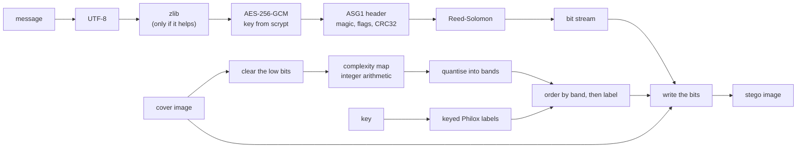

# AdaptiveStego

[](https://github.com/RE22GDV/AdaptiveStego/actions/workflows/ci.yml)
[](https://www.python.org/)
[](LICENSE)
[](#installation)

A research bench for image steganography and steganalysis: content-adaptive LSB
embedding, minimum-distortion embedding through syndrome-trellis coding, five
baseline methods to compare them against, quality metrics, twelve attacks on
the container, classical detectors, and a desktop interface in English,
Ukrainian and Russian.

**The hypothesis this project exists to test.** Choosing which samples and which
colour channels carry the message according to the local textural complexity of
the image lowers the detectability of the message at a comparable capacity and
visual quality.


The same 2.5 KB message, hidden four ways. Sequential LSB fills the image from
the top regardless of content. Random LSB spreads over everything, flat areas
included. The adaptive methods trace the edges and settle in the texture, and
they leave the flat rectangle untouched - the receiver still finds them, because
the map that ranks the pixels is computed from bits that embedding never
changes.

---

## Table of contents

- [Installation](#installation)
- [Usage](#usage) - [desktop](#desktop-interface), [command line](#command-line), [Python](#python-api)
- [How it works](#how-it-works)
- [Methods](#embedding-methods)
- [Syndrome coding](docs/syndrome-coding.md)
- [Experimental results](#experimental-results)
- [Performance](#performance)
- [Reproducibility](#reproducibility)
- [What it does not do](#what-it-does-not-do)
- [Project layout](#project-layout)
- [Development](#development)

---

## Installation

Python 3.10 or newer, on Windows, macOS or Linux.

```bash
git clone https://github.com/RE22GDV/AdaptiveStego.git
cd AdaptiveStego
pip install -r requirements.txt
```

Or install the package itself, which also puts `adaptivestego` and `adaptivestego-gui` on
your PATH:

```bash
pip install -e ".[all]"
```

The library needs only **numpy** and **opencv-python**. Everything else is
optional: `cryptography` for password protection, `reedsolo` for error
correction, `pandas`/`matplotlib`/`scipy` for the experiment scripts. Missing
optional packages are reported with the exact command to install them, never as
an import traceback.

The desktop interface uses tkinter, which ships with CPython on Windows and
macOS. Some Linux distributions package it separately:

```bash
sudo apt install python3-tk        # Debian, Ubuntu
sudo dnf install python3-tkinter   # Fedora
sudo pacman -S tk                  # Arch
```

Verify the installation, including that it produces bit-identical results to the
reference build:

```bash
python -m adaptivestego selftest
```

## Usage

### Desktop interface

```bash
python -m adaptivestego gui
```


Five tabs: **Embed** (with a live capacity readout and a map of the pixels that
changed), **Extract**, **Analyse** (chi-square, SPA, bit-plane statistics, and
capacity per method), **Benchmark** (compare every method on your own images and
export the table as CSV) and **About** (the determinism self-test).

The interface language is chosen in the top right corner - English, Ukrainian or
Russian - and the choice is remembered between sessions. Long operations run in
a worker thread, so the window stays responsive on large images.


The same panel in each of the three languages:


### Command line

```bash
# hide a message, encrypted, with error correction
python -m adaptivestego embed -c cover.png -o stego.png -t "meet at 17:40" \
    --method adaptive --key my-key --password --ecc 16

# recover it
python -m adaptivestego extract -i stego.png --method adaptive --key my-key --password

# how much would fit
python -m adaptivestego capacity -i cover.png --method adaptive

# is there anything in this image?
python -m adaptivestego analyze -i suspect.png

# quality of a cover/stego pair, and attacks on a container
python -m adaptivestego metrics -c cover.png -s stego.png
python -m adaptivestego attack -i stego.png -o attacked.png --attack jpeg:quality=90
```

Passwords are never taken from the command line by default: `--password` without
a value prompts for it, and `--password-env VAR` reads it from the environment,
so it does not end up in the process list or the shell history.

### Python API

```python
import adaptivestego as sl

cover = sl.read_image("cover.png")
result = sl.embed(cover, "secret", method="adaptive", key="my-key",
                  password="pw", ecc_nsym=16)
sl.write_image("stego.png", result.stego)

print(result.summary())
# {'method': 'adaptive', 'payload_bytes': 91, 'bpp': 0.0071, ...}

message = sl.extract(sl.read_image("stego.png"), method="adaptive",
                     key="my-key", password="pw")
```

For experiments there is a raw mode that writes exactly the bits you give it,
with no container header, so a payload of 0.4 bpp means exactly that:

```python
bits = sl.payload_bits_for_bpp(cover, 0.4)          # 0.4 * pixels, rounded
payload = adaptivestego.prng.deterministic_bits("seed-material", "payload", bits)
result = sl.embed_raw(cover, payload, method="adaptive", key="k")
back = sl.extract_raw(result.stego, bits, method="adaptive", key="k")
```

The method, the key and the map settings are **not stored in the image**. The
receiver has to know them; only what is needed to validate the data is embedded
(see [the container format](docs/format.md)).

## How it works



Two design decisions carry most of the weight.

**The map is computed from the image with its lowest bits cleared** - exactly
the bits that embedding is allowed to change. Sender and receiver therefore
derive the same ranking of pixels from different images, and no synchronisation
data has to be transmitted. For +/-1 embedding the direction of the change is
constrained so that a carry can never reach the bits the map depends on.

**Everything on that path is integer arithmetic.** A one-ULP difference in a
floating point map on another machine would move a pixel into a neighbouring
band, shift the whole ordering and destroy the message. Convolutions run in
CV_16S, window sums through an integral image in int64, normalisation through
exact order statistics, and the entropy table is computed with `decimal` rather
than the platform's libm.

Full diagrams, including extraction and the lazy ordering, are in
[docs/architecture.md](docs/architecture.md).

## Embedding methods

| Method | Order of positions | Bit written | Role |
|---|---|---|---|
| `sequential` | consecutive, from the top-left | LSB replacement | baseline, trivially detected |
| `random` | keyed permutation | LSB replacement | keyed baseline |
| `matching` | keyed permutation | +/-1 | outside the reach of chi-square and SPA |
| `edge` | Sobel gradient | LSB replacement | classic edge-adaptive LSB |
| `adaptive` | combined complexity map | LSB replacement | the proposed method |
| `adaptive-matching` | combined complexity map | +/-1 | the proposed method with +/-1 |
| `stc` | none - raster order | +/-1 | syndrome coding with this project's cost model |
| `wow` | none - raster order | +/-1 | syndrome coding with the WOW cost model |
| `uniward` | none - raster order | +/-1 | syndrome coding with the S-UNIWARD cost model |

The combined map sums the normalised Sobel gradient, local variance, local
entropy, a high-pass response and the spread between colour channels, then
weights the channels by how visible a change is in each.

The last three are different in kind from the other six. It does not rank anything: the
message is the syndrome of the whole stego bit vector under a keyed parity
check matrix, and the encoder searches the trellis for the cheapest vector that
satisfies it. The decoder therefore needs no cost map at all - which also means
the map may be built from the untouched cover at full precision. See
[docs/syndrome-coding.md](docs/syndrome-coding.md).

They share one coder and differ only in the cost model, which is what makes
them comparable. `wow` and `uniward` are ports of the reference implementations
published by the Binghamton DDE Lab, and they are checked against that MATLAB
code rather than assumed correct: on four test images the costs agree to
**4e-11 or better** once clamped at a cost no embedder would ever act on, and
the maps of unusable samples match exactly. The comparison is pinned by committed
reference vectors, so it re-runs on every commit without MATLAB
(see [matlab/README.md](matlab/README.md)).

It was worth doing. The first comparison failed by a factor of five: MATLAB's
`conv2(..., 'same')` starts one sample later than the same call in OpenCV or
SciPy, and with two convolutions per filter that shifted every cost map by two
pixels. The two files also disagree on the wet cost - 10^10 in `WOW.m`, 10^8 in
`S_UNIWARD.m` - which no description of either algorithm mentions.

## Experimental results

Everything below is reproduced by the scripts in `experiments/`. The design
matters as much as the numbers, so it is stated first.

**Research mode.** Payloads are raw: exactly `bpp x pixels` pseudo-random bits,
with no container header. The application container carries a fixed signature,
flags and checksums, and those constant bytes would become part of the stego
signal - an extra variable that has nothing to do with the algorithm under
test. At 0.4 bpp on a 256x256 cover the payload is exactly 26214 bits.

**One key and one payload per case.** Every (cover, replicate) pair derives its
own embedding key and its own payload from the cover content, the replicate
index and a master key:

```
case_id       = SHA-256(cover bytes + shape + replicate)
embedding key = HMAC-SHA256(master key, "placement/" + case_id)
payload       = HMAC-SHA256(master key, "payload/"   + case_id) -> Philox stream
```

A single fixed key and a single fixed payload would paint the *same* spatial
pattern into every image of the same size, and a neural detector would learn
that pattern instead of the embedding algorithm. The derivation is content
addressed, so the whole experiment regenerates from one master key on any
machine.

**Confidence intervals are clustered.** Three replicates of one cover are not
three independent observations - image content dominates every metric here.
Replicates are averaged within a cover first, and the intervals come from a
bootstrap over the 12 covers. Method comparisons are paired on the cover,
because every method sees exactly the same images.

```bash
python experiments/benchmark.py --synthetic 12 --size 256 --seeds 3 --out results/main
python experiments/report.py results/main.csv
```

### Detectability at an equal payload

12 synthetic covers x 3 replicates, detectability from sample pair analysis
(SPA); a clean cover scores **0.0027**. Intervals are 95% cluster bootstrap
over covers.


| Method | 0.05 bpp | 0.1 bpp | 0.2 bpp | 0.4 bpp | PSNR @0.4 | SSIM @0.4 |
|---|---|---|---|---|---|---|
| sequential | 0.0128 | 0.0303 | 0.0630 | 0.1296 [0.1259, 0.1328] | 59.89 dB | 0.99900 |
| random | 0.0105 | 0.0254 | 0.0584 | 0.1254 [0.1221, 0.1286] | 59.90 dB | 0.99920 |
| adaptive | 0.0116 | 0.0149 | 0.0249 | 0.0524 [0.0496, 0.0549] | 59.90 dB | 0.99940 |
| edge | 0.0111 | 0.0128 | 0.0184 | 0.0403 [0.0377, 0.0428] | 59.89 dB | 0.99940 |
| adaptive-matching | 0.0099 | 0.0116 | 0.0184 | **0.0324 [0.0292, 0.0354]** | 59.89 dB | 0.99940 |
| matching | 0.0027 | 0.0026 | 0.0024 | 0.0028 [0.0013, 0.0044] | 59.90 dB | 0.99920 |
| stc | 0.0029 | 0.0032 | 0.0036 | 0.0034 [0.0018, 0.0052] | 63.86 dB | 0.99970 |
| wow | 0.0028 | 0.0029 | 0.0031 | 0.0030 [0.0015, 0.0047] | 64.24 dB | 0.99970 |
| uniward | 0.0027 | 0.0028 | 0.0030 | 0.0029 [0.0014, 0.0045] | **64.58 dB** | 0.99970 |

Paired against random LSB on the same covers, at 0.4 bpp:

| Method | SPA difference per cover | Ratio | Better on |
|---|---|---|---|
| adaptive | -0.0730 [-0.0751, -0.0710] | 0.42x | 12 of 12 covers |
| edge | -0.0851 [-0.0868, -0.0832] | 0.32x | 12 of 12 covers |
| adaptive-matching | -0.0931 [-0.0951, -0.0910] | 0.26x | 12 of 12 covers |
| stc | -0.1220 [-0.1245, -0.1197] | 0.02x | 12 of 12 covers |
| sequential | +0.0041 [+0.0030, +0.0054] | 1.03x | 0 of 12 covers |

Three things worth stating plainly:

* At a substantial payload the adaptive ordering is clearly better: 2.4x lower
  SPA than random LSB at 0.4 bpp, 3.9x when combined with +/-1, on every single
  cover, at equal PSNR and slightly better SSIM.
* **At 0.05 bpp the advantage is gone.** `adaptive` is in fact marginally
  *worse* than random there (+0.0011, interval excluding zero) and `edge` is
  indistinguishable from it. With so few changes the estimator is near its own
  noise floor, and concentrating those few changes buys nothing.
* `matching` and the three syndrome-coded methods sit at the cover baseline for
  a structural reason, not a good one: SPA is built on the value pairs that LSB replacement creates, so it
  is not designed to detect +/-1 embedding at all. **Their SPA numbers are not
  evidence of undetectability** and must not be read as such; that question
  needs a detector that works against +/-1, which is what SRNet is for.

### Cost models compared with the coder held fixed

`stc`, `wow` and `uniward` run the same syndrome coder over the same covers
with the same payloads. The only difference is which cost model decides what a
change is worth, so the comparison is about the cost model alone.

| Payload bits per change | 0.05 bpp | 0.1 bpp | 0.2 bpp | 0.4 bpp |
|---|---|---|---|---|
| S-UNIWARD | **7.82** | **7.30** | **6.66** | **5.88** |
| WOW | 6.69 | 6.35 | 5.99 | 5.45 |
| this project | 5.99 | 5.71 | 5.38 | 4.99 |

**Our cost model comes third of three, on both counts.** At 0.4 bpp S-UNIWARD
needs 2.27 % of the samples where ours needs 2.67 %, and its PSNR is 0.7 dB
higher. It is also the slowest to compute: 513 ms against 169 ms for WOW and
149 ms for S-UNIWARD on a one megapixel cover, because it builds five
sub-maps where they take three convolutions.

That is the honest state of the work. The complexity map was designed to
*rank* samples for the ordering codecs, not to price them, and its floor and
gamma have never been fitted. The one caveat in its favour is that these are
synthetic covers; the ranking may differ on BOSSBase.

Nothing here says anything about detectability. All three are +/-1 methods, so
SPA cannot see them, and the question of which cost model actually hides better
needs a detector that can - which is what the SRNet work in the
[roadmap](docs/roadmap.md) is for.

### What syndrome coding actually buys

The defensible claim for `stc` is about distortion, not detectability, and it
is large. At 0.4 bpp, with the same payload in the same images:

| Method | Samples changed | Payload bits per change | PSNR | Embed time |
|---|---|---|---|---|
| uniward | **2.27 %** | **5.88** | **64.58 dB** | 1.48 s |
| wow | 2.45 % | 5.44 | 64.24 dB | 2.03 s |
| stc | 2.67 % | 4.99 | 63.86 dB | 1.56 s |
| adaptive | 6.66 % | 2.00 | 59.90 dB | 0.029 s |
| random | 6.66 % | 2.00 | 59.90 dB | 0.007 s |
| sequential | 6.67 % | 2.00 | 59.89 dB | 0.0005 s |

Ordered placement flips a bit whenever the cover bit disagrees with the message
bit, which is half the time, so it is stuck at 2 payload bits per change. The
trellis search instead picks, among all bit vectors with the right syndrome,
the one whose changes are cheapest - 2.5x fewer changes and nearly 4 dB of
PSNR, at about fifty times the embedding cost. Extraction stays cheap, since it
is only a syndrome computation.

The implementation is verified against brute force: for vectors short enough to
enumerate, all 2^n candidates are searched and the trellis result must match
the true minimum exactly, with and without unusable samples.

### Ablation: which complexity map matters


SPA estimate for the adaptive codec with one map at a time (lower is better):

| Map | 0.1 bpp | 0.2 bpp | 0.4 bpp |
|---|---|---|---|
| sobel | 0.0128 | 0.0184 | **0.0403** |
| variance | 0.0228 | 0.0287 | 0.0503 |
| combined | 0.0149 | 0.0249 | 0.0524 |
| entropy | 0.0147 | 0.0278 | 0.0580 |
| highfreq | 0.0317 | 0.0503 | 0.0856 |
| laplacian | 0.0269 | 0.0480 | 0.0869 |
| uniform (control) | 0.0258 | 0.0594 | 0.1268 |
| chroma | 0.0752 | 0.1131 | 0.2362 |

* The **control works**. A uniform map removes every content preference, and
  the adaptive codec then scores 0.1268 against random LSB's 0.1254. The gain
  comes from the content of the map, not from the machinery around it.
* The **plain Sobel map beats the combined one**. The combined weights were
  chosen a priori and have deliberately not been tuned on these results;
  tuning them here and then reporting the same numbers would be fitting the
  test set.
* **Chroma is actively harmful** - almost twice as detectable as no adaptivity
  at all. Placing bits where the colour channels disagree correlates with
  exactly what SPA looks for.

### Robustness and error correction

Application mode, 0.2 bpp, fraction of messages recovered in full:

| Method | Attack | no ECC | 8 | 16 | 32 |
|---|---|---|---|---|---|
| random | pixel damage, p=0.0002 | 0.33 | 1.00 | 1.00 | 1.00 |
| random | pixel damage, p=0.001 | 0.00 | 0.96 | 1.00 | 1.00 |
| random | salt and pepper, p=0.0002 | 0.33 | 1.00 | 1.00 | 1.00 |
| adaptive | any of the above | 0.00 | 0.00 | 0.00 | 0.00 |

Error correction rescues the non-adaptive methods completely and does nothing
at all for the adaptive ones. That is not a failure of the ECC: the receiver
rebuilds the order of positions from the image, so one sample that moves into a
different band after an attack shifts every subsequent bit. Syndrome coding
(STC) is what removes that dependence - see the [roadmap](docs/roadmap.md).

No method survives JPEG, rescaling or noise above sigma = 0.3. That is a
property of LSB embedding in the spatial domain, not of this implementation.

## Performance

Measured on Windows 11, Python 3.12, single core, 0.2 bpp payload
(`python experiments/performance.py`):


| Method | 0.07 Mpx | 0.26 Mpx | 1.0 Mpx | 4.2 Mpx | Peak memory @1 Mpx |
|---|---|---|---|---|---|
| sequential | 0 ms | 1 ms | 2 ms | 12 ms | 6 MB |
| random | 5 ms | 25 ms | 105 ms | 452 ms | 72 MB |
| matching | 6 ms | 26 ms | 113 ms | 482 ms | 72 MB |
| edge | 10 ms | 48 ms | 291 ms | 1.1 s | 107 MB |
| adaptive | 23 ms | 125 ms | 886 ms | 3.7 s | 107 MB |
| adaptive-matching | 24 ms | 141 ms | 957 ms | 3.6 s | 107 MB |
| stc | 985 ms | 4.2 s | 17.7 s | 65.1 s | 249 MB |

Extraction costs about the same as embedding for the ordering codecs. Syndrome
coding is the exception in both directions: embedding runs a Viterbi pass over
2^height states and is roughly fifty times slower, while extraction is only a
syndrome computation and is *faster* than the adaptive codecs - 0.6 s against
0.9 s at one megapixel. Its memory grows with the trellis: 249 MB at one
megapixel, 1.0 GB at four.

Syndrome coding does not order anything, so the shortcut below does not apply
to it; its cost is the trellis search itself.

**The ordering is built lazily.** A message almost never fills an image, so
ordering every sample of a photograph to write a few kilobytes is wasted work.
Each codec can produce just the first N positions: a partition for the keyed
methods, a histogram of the bands for the adaptive ones. Both return exactly the
prefix of the full ordering, ties included, which the test suite verifies for
every codec and every limit.

| At 1 Mpx | Before | After | Speed-up |
|---|---|---|---|
| adaptive, embed | 6548 ms | 886 ms | 7.4x |
| adaptive, extract | 3267 ms | 891 ms | 3.7x |
| random, embed | 1974 ms | 105 ms | 19x |
| random, extract | 947 ms | 106 ms | 8.9x |

The determinism digest is unchanged by the optimisation, which is the strongest
statement available that the output is byte for byte identical.

## Reproducibility

An adaptive stego image only decodes if the receiver's complexity map matches
the sender's exactly. "It should be deterministic" is not worth much without a
way to check, so:

```bash
$ python -m adaptivestego selftest
python 3.12.10  numpy 2.1.2  opencv 4.13.0
platform Windows-11-10.0.26200-SP0 (AMD64)
methods checked: sequential, random, matching, edge, adaptive, adaptive-matching
digest   e9bdd51a26f7d5a9395135fa91869964ad72975be9b64108e33922c99c8959bc
expected e9bdd51a26f7d5a9395135fa91869964ad72975be9b64108e33922c99c8959bc
OK: this installation is interoperable with the reference build
```

The digest covers every complexity map, the keyed permutation, the position
order of every codec, the packed container and the resulting stego images. Two
machines that print the same digest can exchange stego images.

CI checks this on every commit and the guarantee holds in practice: Windows,
macOS and Linux, Python 3.10 and 3.12, numpy 2.1 and 2.2, OpenCV 4.13 and 5.0
all produce the digest above, byte for byte.

Experiment runs also write a `*.meta.json` next to their results with the full
command line, the library version, the key and the seeds.

## What it does not do

* **It does not survive image processing.** JPEG, rescaling, cropping and noise
  destroy the message. Send stego images as PNG or BMP; `write_image` refuses to
  write a lossy format.
* **It is not encryption by itself.** Without `--password` the payload is stored
  in the clear and anyone who knows the method and the key can read it.
  Steganography hides that a message exists; cryptography protects what it says.
* **The detectors here are a weak baseline.** Chi-square and SPA see LSB
  replacement and are blind to +/-1. A claim about "lower detectability" only
  becomes real against an SRNet-class detector, on BOSSBase or ALASKA#2.
* **The results above are on synthetic covers.** They demonstrate that the bench
  works and that the effect exists; they are not a publishable finding.
* **Robustness numbers depend on the mode.** Error correction only exists in the
  application container; research mode carries the payload and nothing else.

The full threat model is in [docs/limitations.md](docs/limitations.md).

## Project layout

```
src/adaptivestego/
  api.py          embed / extract / capacity
  container.py    the ASG1 format: header, flags, checksums
  crypto.py       scrypt + AES-256-GCM
  ecc.py          Reed-Solomon
  core.py         writing and reading bits at given positions
  maps.py         integer complexity maps
  costs.py        the same maps read as per-direction embedding costs
  stc.py          syndrome-trellis coding, exact minimum-distortion search
  prng.py         deterministic keyed ordering
  codecs/         the seven methods behind one registry
  metrics.py      PSNR, SSIM, BER, embedding efficiency
  attacks.py      twelve container distortions
  analysis.py     chi-square, SPA, bit-plane statistics
  selftest.py     the cross-platform determinism digest
  gui.py          tkinter interface
  i18n.py         English, Ukrainian, Russian
  cli.py          command line interface
experiments/      benchmark, report, performance, figures
docs/             format, architecture, syndrome coding, limitations, protocol
tests/            111 tests plus a runner that works without pytest
legacy/           the original decoder.py this project grew out of
```

## Development

```bash
pip install -r requirements-dev.txt
pytest -q                    # the test suite
python tests/run_tests.py    # the same suite without pytest
ruff check src tests experiments examples
python -m adaptivestego selftest
```

CI runs the suite on Windows, macOS and Linux for Python 3.10 through 3.13,
plus a job with only numpy and opencv installed to make sure the optional
dependencies really are optional. The Linux jobs run the GUI tests under xvfb
rather than skipping them.

For a frozen environment there is `requirements-lock.txt` (exact versions of
every direct and transitive dependency) and a `Dockerfile`:

```bash
docker build -t adaptivestego .
docker run --rm adaptivestego selftest
```

Where the project is going next - syndrome coding, an SRNet detector, runs on
BOSSBase and ALASKA#2 - is written down in [docs/roadmap.md](docs/roadmap.md).

## Citation and licence

If this code is useful in your research, cite it through
[CITATION.cff](CITATION.cff). Released under the [MIT licence](LICENSE).
