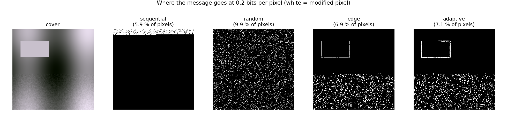
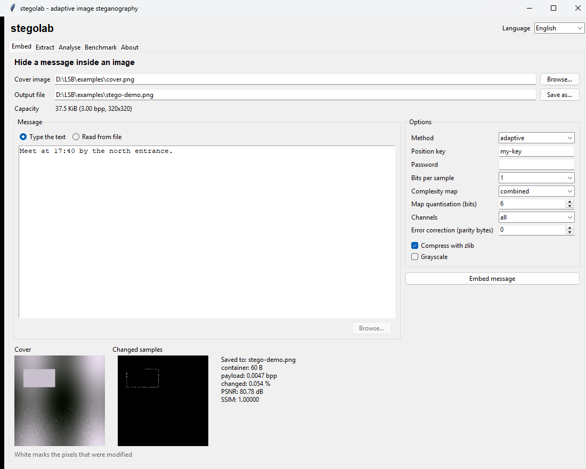
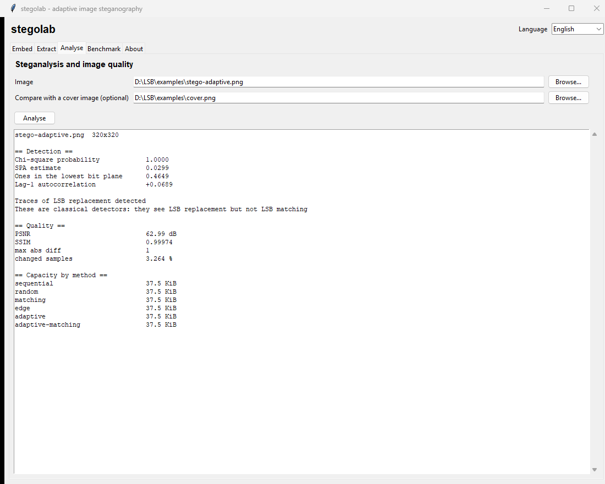
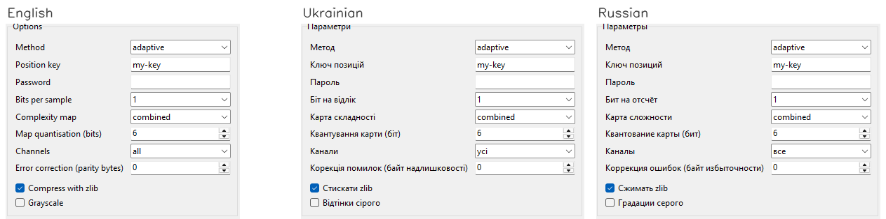
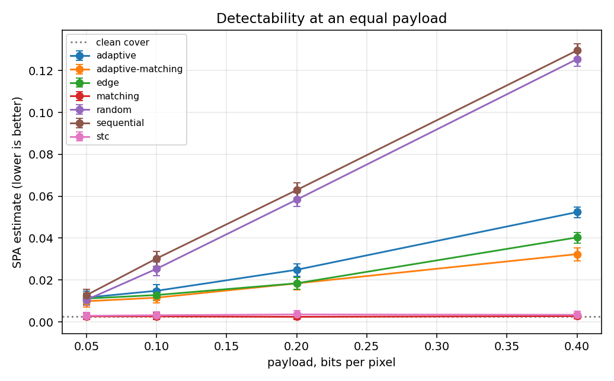
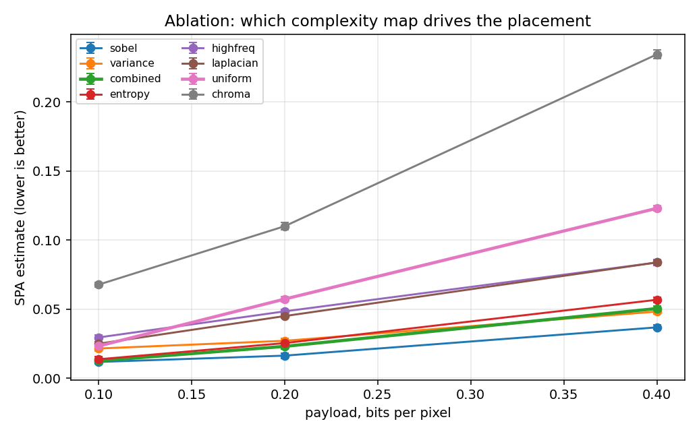
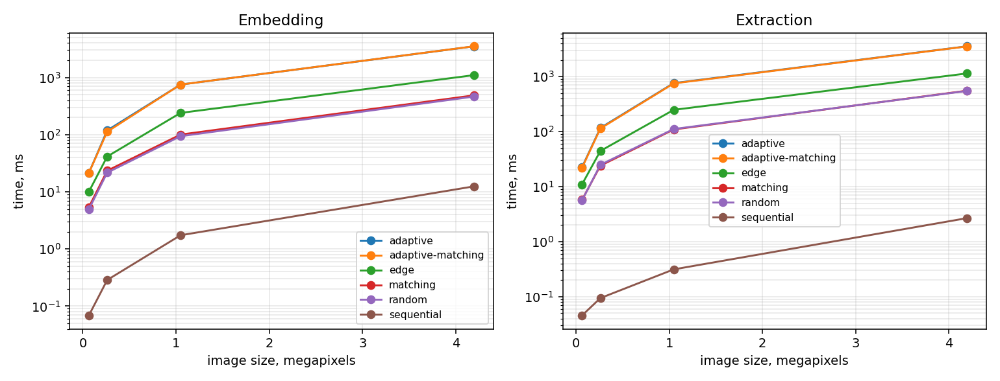

# stegolab

[](https://github.com/RE22GDV/stegolab/actions/workflows/ci.yml)
[](https://www.python.org/)
[](LICENSE)
[](#installation)

A research bench for image steganography and steganalysis: content-adaptive LSB
embedding, five baseline methods to compare it against, quality metrics, twelve
attacks on the container, classical detectors, and a desktop interface in
English, Ukrainian and Russian.

**The hypothesis this project exists to test.** Choosing which samples and which
colour channels carry the message according to the local textural complexity of
the image lowers the detectability of the message at a comparable capacity and
visual quality.



The same 2.5 KB message, hidden four ways. Sequential LSB fills the image from
the top regardless of content. Random LSB spreads over everything, flat areas
included. The adaptive methods trace the edges and settle in the texture, and
they leave the flat rectangle untouched - the receiver still finds them, because
the map that ranks the pixels is computed from bits that embedding never
changes.

---

## Table of contents

- [Installation](#installation)
- [Usage](#usage) - [desktop](#desktop-interface), [command line](#command-line), [Python](#python-api)
- [How it works](#how-it-works)
- [Methods](#embedding-methods)
- [Experimental results](#experimental-results)
- [Performance](#performance)
- [Reproducibility](#reproducibility)
- [What it does not do](#what-it-does-not-do)
- [Project layout](#project-layout)
- [Development](#development)

---

## Installation

Python 3.10 or newer, on Windows, macOS or Linux.

```bash
git clone https://github.com/RE22GDV/stegolab.git
cd stegolab
pip install -r requirements.txt
```

Or install the package itself, which also puts `stegolab` and `stegolab-gui` on
your PATH:

```bash
pip install -e ".[all]"
```

The library needs only **numpy** and **opencv-python**. Everything else is
optional: `cryptography` for password protection, `reedsolo` for error
correction, `pandas`/`matplotlib`/`scipy` for the experiment scripts. Missing
optional packages are reported with the exact command to install them, never as
an import traceback.

The desktop interface uses tkinter, which ships with CPython on Windows and
macOS. Some Linux distributions package it separately:

```bash
sudo apt install python3-tk        # Debian, Ubuntu
sudo dnf install python3-tkinter   # Fedora
sudo pacman -S tk                  # Arch
```

Verify the installation, including that it produces bit-identical results to the
reference build:

```bash
python -m stegolab selftest
```

## Usage

### Desktop interface

```bash
python -m stegolab gui
```



Five tabs: **Embed** (with a live capacity readout and a map of the pixels that
changed), **Extract**, **Analyse** (chi-square, SPA, bit-plane statistics, and
capacity per method), **Benchmark** (compare every method on your own images and
export the table as CSV) and **About** (the determinism self-test).

The interface language is chosen in the top right corner - English, Ukrainian or
Russian - and the choice is remembered between sessions. Long operations run in
a worker thread, so the window stays responsive on large images.



The same panel in each of the three languages:



### Command line

```bash
# hide a message, encrypted, with error correction
python -m stegolab embed -c cover.png -o stego.png -t "meet at 17:40" \
    --method adaptive --key my-key --password --ecc 16

# recover it
python -m stegolab extract -i stego.png --method adaptive --key my-key --password

# how much would fit
python -m stegolab capacity -i cover.png --method adaptive

# is there anything in this image?
python -m stegolab analyze -i suspect.png

# quality of a cover/stego pair, and attacks on a container
python -m stegolab metrics -c cover.png -s stego.png
python -m stegolab attack -i stego.png -o attacked.png --attack jpeg:quality=90
```

Passwords are never taken from the command line by default: `--password` without
a value prompts for it, and `--password-env VAR` reads it from the environment,
so it does not end up in the process list or the shell history.

### Python API

```python
import stegolab as sl

cover = sl.read_image("cover.png")
result = sl.embed(cover, "secret", method="adaptive", key="my-key",
                  password="pw", ecc_nsym=16)
sl.write_image("stego.png", result.stego)

print(result.summary())
# {'method': 'adaptive', 'payload_bytes': 91, 'bpp': 0.0071, ...}

message = sl.extract(sl.read_image("stego.png"), method="adaptive",
                     key="my-key", password="pw")
```

The method, the key and the map settings are **not stored in the image**. The
receiver has to know them; only what is needed to validate the data is embedded
(see [the container format](docs/format.md)).

## How it works


Two design decisions carry most of the weight.

**The map is computed from the image with its lowest bits cleared** - exactly
the bits that embedding is allowed to change. Sender and receiver therefore
derive the same ranking of pixels from different images, and no synchronisation
data has to be transmitted. For +/-1 embedding the direction of the change is
constrained so that a carry can never reach the bits the map depends on.

**Everything on that path is integer arithmetic.** A one-ULP difference in a
floating point map on another machine would move a pixel into a neighbouring
band, shift the whole ordering and destroy the message. Convolutions run in
CV_16S, window sums through an integral image in int64, normalisation through
exact order statistics, and the entropy table is computed with `decimal` rather
than the platform's libm.

Full diagrams, including extraction and the lazy ordering, are in
[docs/architecture.md](docs/architecture.md).

## Embedding methods

| Method | Order of positions | Bit written | Role |
|---|---|---|---|
| `sequential` | consecutive, from the top-left | LSB replacement | baseline, trivially detected |
| `random` | keyed permutation | LSB replacement | keyed baseline |
| `matching` | keyed permutation | +/-1 | immune to chi-square and SPA |
| `edge` | Sobel gradient | LSB replacement | classic edge-adaptive LSB |
| `adaptive` | combined complexity map | LSB replacement | the proposed method |
| `adaptive-matching` | combined complexity map | +/-1 | the proposed method with +/-1 |

The combined map sums the normalised Sobel gradient, local variance, local
entropy, a high-pass response and the spread between colour channels, then
weights the channels by how visible a change is in each.

## Experimental results

Everything below is reproduced by the scripts in `experiments/`. The runs used
**12 synthetic covers of 256x256, three seeds each (n = 36 per cell)**, random
incompressible payloads and compression disabled. Detectability is measured with
sample pair analysis (SPA); a clean cover scores **0.0027**.

```bash
python experiments/benchmark.py --synthetic 12 --size 256 --seeds 3 --out results/main
python experiments/report.py results/main.csv
```

### Detectability at an equal payload



| Method | 0.05 bpp | 0.1 bpp | 0.2 bpp | 0.4 bpp | PSNR @0.4 | SSIM @0.4 |
|---|---|---|---|---|---|---|
| sequential | 0.0098 | 0.0250 | 0.0570 | 0.1230 ±0.0019 | 59.94 dB | 0.99910 |
| random | 0.0095 | 0.0234 | 0.0588 | 0.1254 ±0.0023 | 59.96 dB | 0.99920 |
| adaptive | 0.0108 | 0.0127 | 0.0231 | 0.0505 ±0.0018 | 59.97 dB | 0.99940 |
| edge | 0.0095 | 0.0118 | 0.0164 | 0.0369 ±0.0017 | 59.96 dB | 0.99940 |
| adaptive-matching | 0.0094 | 0.0099 | 0.0161 | **0.0314 ±0.0016** | 59.95 dB | 0.99940 |
| matching | 0.0025 | 0.0025 | 0.0038 | 0.0029 ±0.0011 | 59.96 dB | 0.99920 |

At an equal payload the adaptive ordering cuts the SPA estimate by a factor of
**2.5** against random LSB, and combining it with +/-1 embedding by a factor of
**4**, while PSNR stays level and SSIM improves slightly. `matching` sits at the
cover baseline for a structural reason rather than a good one: SPA cannot detect
+/-1 embedding at all, which is precisely why a neural detector is needed before
any of these numbers become a real claim.

### Ablation: which complexity map matters



SPA estimate for the adaptive codec with one map at a time (lower is better):

| Map | 0.1 bpp | 0.2 bpp | 0.4 bpp |
|---|---|---|---|
| sobel | 0.0118 | 0.0164 | **0.0369** |
| variance | 0.0216 | 0.0272 | 0.0483 |
| combined | 0.0127 | 0.0231 | 0.0505 |
| entropy | 0.0138 | 0.0255 | 0.0568 |
| highfreq | 0.0296 | 0.0484 | 0.0838 |
| laplacian | 0.0250 | 0.0450 | 0.0838 |
| uniform (control) | 0.0234 | 0.0573 | 0.1230 |
| chroma | 0.0678 | 0.1101 | 0.2344 |

Three things worth stating plainly:

* The **control works**. A uniform map turns the adaptive codec into keyed
  random placement, and it scores 0.1230 against random LSB's 0.1254. The gain
  really does come from the content of the map and not from the machinery
  around it.
* The **plain Sobel map beats the combined one** in this setting. The combined
  weights were chosen a priori and have deliberately not been tuned on these
  results; tuning them here and then reporting the same numbers would be
  fitting the test set.
* **Chroma is actively harmful** - twice as detectable as no adaptivity at all.
  Placing bits where the colour channels disagree turns out to correlate with
  exactly what SPA looks for.

### Robustness and error correction

Fraction of messages recovered in full at 0.2 bpp, by Reed-Solomon parity bytes:

| Method | Attack | no ECC | 8 | 16 | 32 |
|---|---|---|---|---|---|
| random | pixel damage, p=0.0002 | 0.33 | 1.00 | 1.00 | 1.00 |
| random | pixel damage, p=0.001 | 0.00 | 1.00 | 1.00 | 1.00 |
| random | salt and pepper, p=0.0002 | 0.33 | 1.00 | 1.00 | 1.00 |
| adaptive | any of the above | 0.00 | 0.00 | 0.00 | 0.00 |

Error correction rescues the non-adaptive methods completely, and does nothing
at all for the adaptive ones. That is not a bug in the ECC: the receiver rebuilds
the order of positions from the image, so a single sample that moves into a
different band after an attack shifts every subsequent bit. The proper fix is
syndrome coding (STC), which is the next major item on the
[roadmap](docs/roadmap.md).

No method survives JPEG, rescaling or noise above sigma = 0.3. That is a
property of LSB embedding in the spatial domain, not of this implementation.

## Performance

Measured on Windows 11, Python 3.12, single core, 0.2 bpp payload
(`python experiments/performance.py`):



| Method | 0.07 Mpx | 0.26 Mpx | 1.0 Mpx | 4.2 Mpx | Peak memory @1 Mpx |
|---|---|---|---|---|---|
| sequential | 0.1 ms | 0.3 ms | 1.7 ms | 12 ms | 6 MB |
| random | 4.9 ms | 22 ms | 94 ms | 463 ms | 72 MB |
| matching | 5.4 ms | 23 ms | 100 ms | 487 ms | 72 MB |
| edge | 10 ms | 41 ms | 240 ms | 1099 ms | 107 MB |
| adaptive | 21 ms | 119 ms | 751 ms | 3506 ms | 107 MB |

Extraction costs about the same as embedding. A one megapixel photograph is
handled in well under a second even by the most expensive method.

**The ordering is built lazily.** A message almost never fills an image, so
ordering every sample of a photograph to write a few kilobytes is wasted work.
Each codec can produce just the first N positions: a partition for the keyed
methods, a histogram of the bands for the adaptive ones. Both return exactly the
prefix of the full ordering, ties included, which the test suite verifies for
every codec and every limit.

| At 1 Mpx | Before | After | Speed-up |
|---|---|---|---|
| adaptive, embed | 6548 ms | 751 ms | 8.7x |
| adaptive, extract | 3267 ms | 760 ms | 4.3x |
| random, embed | 1974 ms | 94 ms | 21x |
| random, extract | 947 ms | 111 ms | 8.5x |

The determinism digest is unchanged by the optimisation, which is the strongest
statement available that the output is byte for byte identical.

## Reproducibility

An adaptive stego image only decodes if the receiver's complexity map matches
the sender's exactly. "It should be deterministic" is not worth much without a
way to check, so:

```bash
$ python -m stegolab selftest
python 3.12.10  numpy 2.1.2  opencv 4.13.0
platform Windows-11-10.0.26200-SP0 (AMD64)
methods checked: sequential, random, matching, edge, adaptive, adaptive-matching
digest   9da54d9043661ba33118b191a883939d26dfc6509ed1582aa716251037c2a5b7
expected 9da54d9043661ba33118b191a883939d26dfc6509ed1582aa716251037c2a5b7
OK: this installation is interoperable with the reference build
```

The digest covers every complexity map, the keyed permutation, the position
order of every codec, the packed container and the resulting stego images. Two
machines that print the same digest can exchange stego images.

CI checks this on every commit and the guarantee holds in practice: Windows,
macOS and Linux, Python 3.10 and 3.12, numpy 2.1 and 2.2, OpenCV 4.13 and 5.0
all produce the digest above, byte for byte.

Experiment runs also write a `*.meta.json` next to their results with the full
command line, the library version, the key and the seeds.

## What it does not do

* **It does not survive image processing.** JPEG, rescaling, cropping and noise
  destroy the message. Send stego images as PNG or BMP; `write_image` refuses to
  write a lossy format.
* **It is not encryption by itself.** Without `--password` the payload is stored
  in the clear and anyone who knows the method and the key can read it.
  Steganography hides that a message exists; cryptography protects what it says.
* **The detectors here are a weak baseline.** Chi-square and SPA see LSB
  replacement and are blind to +/-1. A claim about "lower detectability" only
  becomes real against an SRNet-class detector, on BOSSBase or ALASKA#2.
* **The results above are on synthetic covers.** They demonstrate that the bench
  works and that the effect exists; they are not a publishable finding.

The full threat model is in [docs/limitations.md](docs/limitations.md).

## Project layout

```
src/stegolab/
  api.py          embed / extract / capacity
  container.py    the SGL1 format: header, flags, checksums
  crypto.py       scrypt + AES-256-GCM
  ecc.py          Reed-Solomon
  core.py         writing and reading bits at given positions
  maps.py         integer complexity maps
  prng.py         deterministic keyed ordering
  codecs/         the six methods behind one registry
  metrics.py      PSNR, SSIM, BER, embedding efficiency
  attacks.py      twelve container distortions
  analysis.py     chi-square, SPA, bit-plane statistics
  selftest.py     the cross-platform determinism digest
  gui.py          tkinter interface
  i18n.py         English, Ukrainian, Russian
  cli.py          command line interface
experiments/      benchmark, report, performance, figures
docs/             format, architecture, limitations, protocol, roadmap
tests/            78 tests plus a runner that works without pytest
legacy/           the original decoder.py this project grew out of
```

## Development

```bash
pip install -r requirements-dev.txt
pytest -q                    # the test suite
python tests/run_tests.py    # the same suite without pytest
ruff check src tests experiments examples
python -m stegolab selftest
```

CI runs the suite on Windows, macOS and Linux for Python 3.10 and 3.12, plus a
job with only numpy and opencv installed to make sure the optional dependencies
really are optional.

Where the project is going next - syndrome coding, an SRNet detector, runs on
BOSSBase and ALASKA#2 - is written down in [docs/roadmap.md](docs/roadmap.md).

## Citation and licence

If this code is useful in your research, cite it through
[CITATION.cff](CITATION.cff). Released under the [MIT licence](LICENSE).
