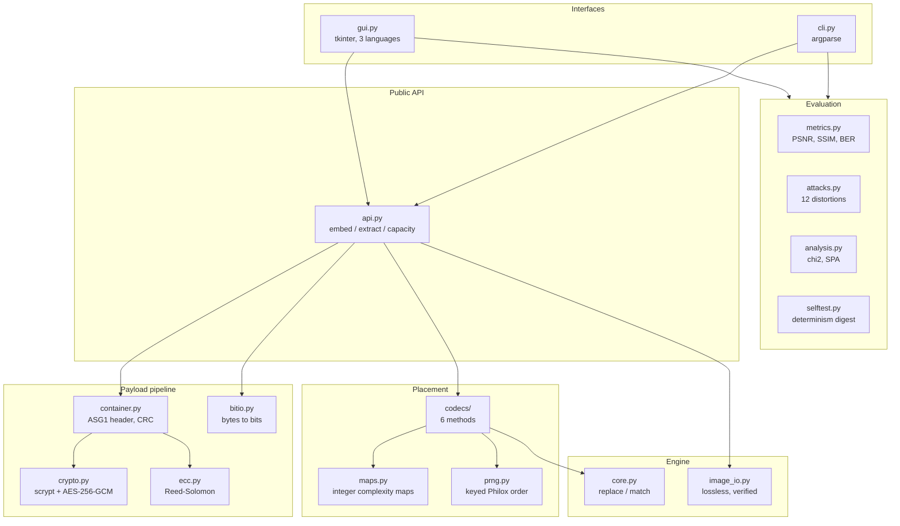
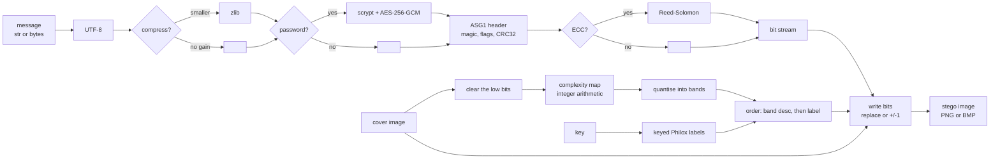
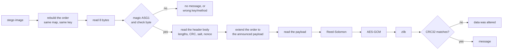

# Architecture

## Module map

## Embedding

The receiver runs the same map on the stego image. Because the map ignores
exactly the bits that embedding may change, it comes out identical and the
order of positions is reproduced without any side information.

## Extraction

## Why the order of positions is computed lazily

A message rarely fills an image. Ordering every sample of a 12 megapixel photo
to write a few kilobytes wastes almost all of the work, so each codec can
produce only the first N positions:

| Codec | Full ordering | First N positions |
|---|---|---|
| `sequential` | `arange(n)` | `arange(N)` |
| `random`, `matching` | stable argsort of n keyed labels | partition to the N smallest labels, then sort those |
| `edge`, `adaptive`, `adaptive-matching` | lexsort by (band, label) | histogram of the bands finds the cut-off band; everything above it is taken whole and only the boundary band is ranked |

Both shortcuts return exactly the prefix of the full ordering, ties included -
the test suite checks that for every codec and every limit, and the determinism
digest is unchanged by the optimisation.

## Layers and their rules

| Layer | Rule it must obey |
|---|---|
| `maps.py` | integer arithmetic only; the same result on every platform |
| `prng.py` | only the raw Philox stream; the permutation is implemented here |
| `container.py` | never trust the input: magic, version, CRC and tag are all checked |
| `core.py` | knows nothing about images or maps, only bits and positions |
| `image_io.py` | refuses lossy formats and re-reads what it wrote |
| `codecs/` | a codec is only an ordering rule; the writing loop is shared |
