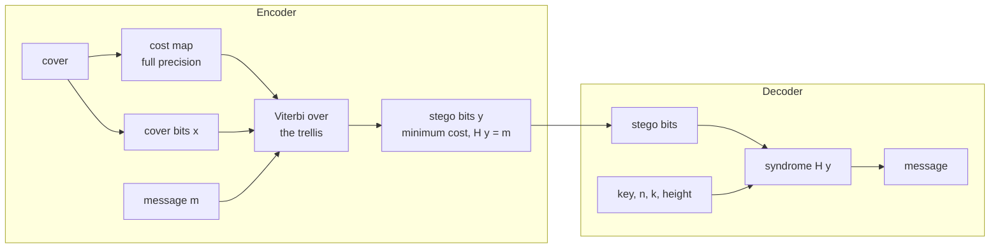

# Syndrome coding

## The problem it solves

The ordering codecs rank the cover samples by a complexity map and write the
message into the first N of them. That forces two things:

* the receiver has to rebuild the same ranking, so the map may only use bits
  that embedding never touches, and the cover has to be read at reduced
  precision;
* the ranking is a global sort. One sample that lands in a different band after
  an attack shifts every later bit, so a single damaged pixel loses the whole
  message - error correction cannot help, because the data is not merely
  corrupted, it is displaced.

Syndrome coding removes both. The message is not written into chosen positions;
it *is* the syndrome of the whole stego bit vector:

```
H y = m
```

`H` is a parity check matrix known to both sides, `y` the lowest bits of the
stego image, `m` the message. The samples stay in raster order. Among all `y`
that satisfy the constraint, the encoder picks one of minimum total cost.



The decoder never sees the cost map. That is the point: the map can be built
from the untouched cover at full precision, and nothing about it has to survive
the channel.

## The matrix

`H` is banded. Each cover element carries an `height`-bit column, and bit `r`
of that column means "this element takes part in constraint `block + r`", where
`block` is the message bit the element belongs to. The n elements are split
into k blocks as evenly as possible, so the payload does not have to be a whole
fraction of the cover.

Banding is what makes the search tractable: an element influences at most
`height` consecutive constraints, so the encoder only has to remember a window
of `height` parity bits - `2**height` trellis states.

The columns are derived from the key, so the matrix is part of the secret while
staying reproducible for the receiver.

## The search is exact

The encoder is a Viterbi pass over the trellis:

* state = the parity accumulated for the constraints still inside the window;
* two transitions per element, "leave the bit alone" and "flip it", costing 0
  and `rho` respectively;
* at the end of each block, states whose lowest parity bit disagrees with the
  message bit are dropped and the window slides on;
* the final state must be zero.

No branch is pruned, so the result is the **true minimum** for that matrix, not
an approximation. The test suite checks exactly that: for vectors short enough
to enumerate (n <= 16), all `2**n` candidates are searched by brute force and
the cost must match to the last digit, with and without unusable samples.

## Costs

`costs.embedding_costs` reads the complexity map the other way round: high
local complexity means a change hides well, so

```
rho = 1 / (complexity + floor) ** gamma
```

Directions are costed separately, because a sample at 255 cannot go up and one
at 0 cannot go down. The forbidden direction gets an infinite ("wet") cost.
Since flipping the lowest bit works with either `+1` or `-1`, the binary cost
is the cheaper of the two and the direction is chosen accordingly; ties are
broken with a keyed coin, because always choosing `+1` would tilt the histogram
of the stego image and that is precisely what a detector looks for.

## What it does not give you

**Robustness.** After an attack the syndrome changes, so bits are still lost.
What changes is the failure mode: previously one displaced sample destroyed
everything downstream, now a damaged sample corrupts a bounded number of
message bits, which is the kind of damage an error correcting code can repair.
Whether ECC on top actually restores the message has to be measured, not
assumed - and it has not been measured yet.

**A self-describing container.** A syndrome is only defined once the payload
length is known, so the ASG1 header - which is discovered by reading a prefix -
cannot be used. `embed` and `extract` refuse the `stc` method with an
explanation; use `embed_raw` / `extract_raw`, or `--mode research` in the
experiment scripts.

## Cost

| Image | Samples | Embed | Extract |
|---|---|---|---|
| 128x128 RGB | 49 152 | 0.24 s | 0.006 s |
| 256x256 RGB | 196 608 | 0.96 s | 0.028 s |
| 512x512 RGB | 786 432 | 3.90 s | 0.118 s |

Extraction is a syndrome computation and costs almost nothing. Embedding is the
Viterbi pass, linear in the number of samples and in `2**height`; the default
height of 8 is a reasonable balance, and the trade-off is measurable through
`--stc-height`.
